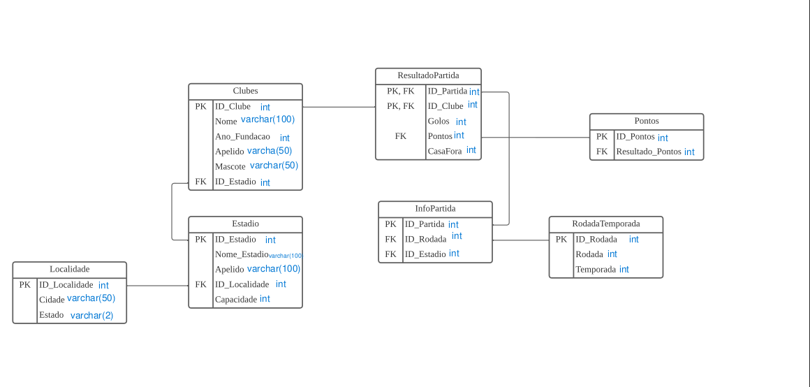
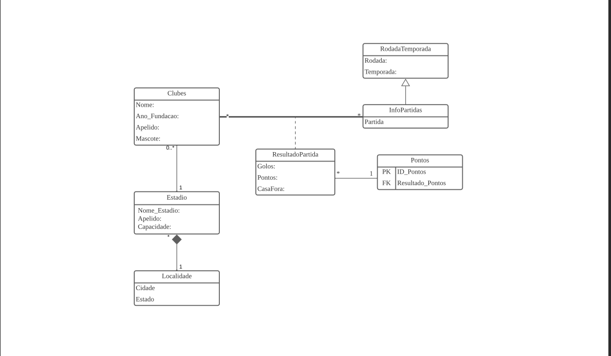
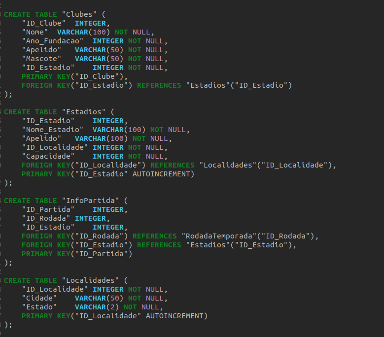
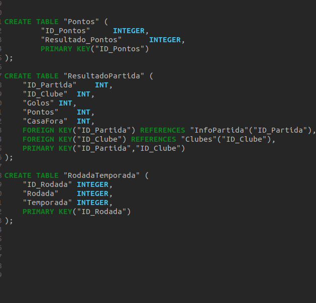
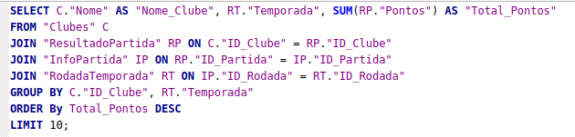
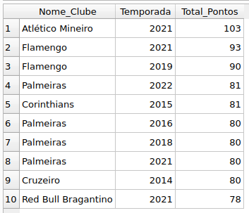

# Assigment - Data Bases

The aim of this task was to make the knowledge from the Database subject a reality, from the development of the logical model to the realisation of the physical model of the database, as well as training in ways of reasoning when obtaining data and inserting it.

In this project, the tool was left to the student's free choice, but it was recommended that SQLite or MySQL be used to develop the database.

SQLite was used because it is a lighter option and the application is easier to use.


## Data Base - Brasileirao

The aim of this database is to gather information from the 2012 to 2023 seasons of the Brazilian Football Championship and from this data we can make some analyses of clubs or the championship as a whole.


## Logic Model - Data Base Brasileirao

The database consists of 7 tables:

-> Localidades: 
Gathers information on the Brazilian states and cities where the clubs and states are located.

-> Estadios: 
Collects information on Brazilian football stadiums that are associated with a club and their information.

-> Clubes: 
Collects information on each of the clubs that took part in the seasons listed. Information such as nicknames, stadium, mascot and foundation.

-> ResultadoPartida: 
Where we can associate the club, goals scored, points scored and whether it was played at home or away.


-> InfoPartida: 
This table is where we can indicate the location of the match, considering that a club may not necessarily play in its own stadium. Brazilian clubs often host large concerts in their stadiums, choose to play in other cities, or may even have ongoing renovations in their stadiums. This table records the match, round, and stadium.

-> RodadaTemporada: 
It is used to store a dictionary of rounds by season.

-> Pontos: 
A table that is used for accounting points and also serves as a dictionary, where we can see if the club lost (0), drew (1), or won (3) the match.





## Physical Model - Data Base Brasileirao





## How did I get the data?

I used a Data Scraping algorithm on the CBF (Brazilian Football Confederation) website, which generated a dataframe in .xlsx format. The algorithm was created in Python, with the help of some libraries:

-Pandas
-BeautifulSoap4
-openpyxl

## Exemple of Querys - Data Base Brasileirao





## Prerequisites to run the projectTools

- To Web Scraping:

 Python (version 3.7 or higher recommended)
 `pip` (Python package installer)

 Pandas Library - Powerful data structures for data analysis, time series, and statistics
 ```pip install pandas```

 BeautifulSoup4 Library - to extract data from HTML and XML files
 ```pip install bs4```

 openpyxl 3.1.5 Library - to read/write Excel xlsx/xlsm files
 ```pip install openpyxl```


- To Data Base:

SQLite (Version 3.47.0)
```
    # Linux Terminal

sudo apt-get update
sudo apt install sqlite3

```
If you prefere, you have a option to use MySQL data bases.

MySQL
``` 
    # Linux Termminal

sudo apt-get update
sudo apt-get install mysql-shell

```